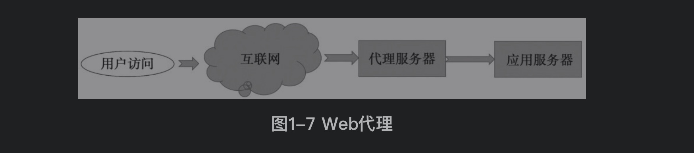
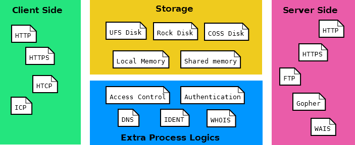
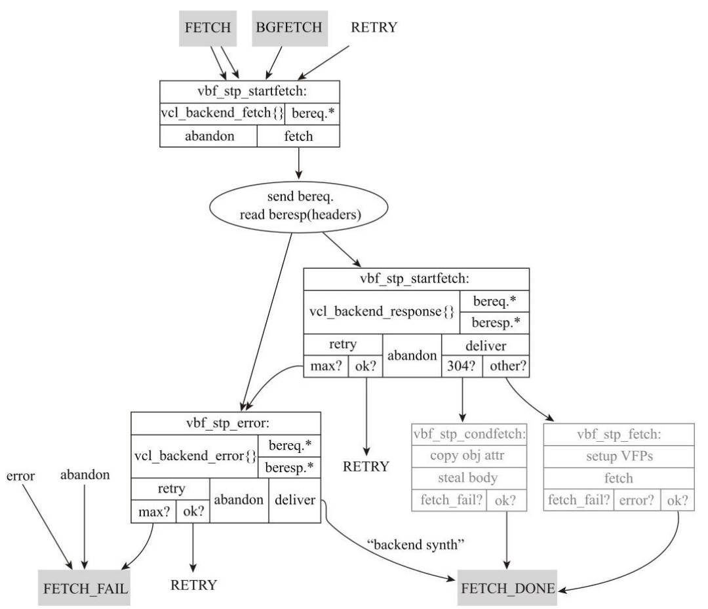
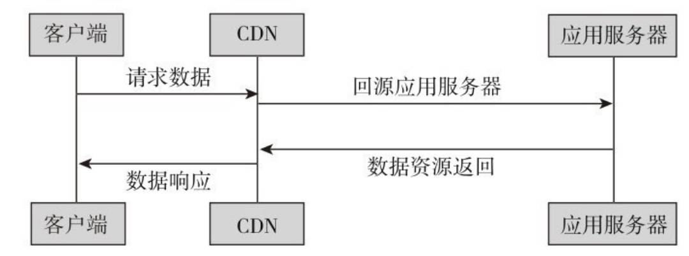

<!-- more -->
### 系统性能
#### 响应时间RT(延迟时间DelayTime)
```text
响应时间是指系统对用户请求做出响应的时间，与人对软件性能的主观感受是非常一致的，它完整地记录了整个系统处理请求的时间
响应时间 = 客户端界面渲染时间 + 系统响应时间
系统响应时间 = 网络耗时 + 应用耗时

延迟时间：制定请求耗时落在指定的响应时间范围称为响应延迟时间
```
 
#### 吞吐量Throughput
```text
吞吐量是指系统在单位时间内处理请求的数量
```

#### 并发用户数Concurrent
```text
并发用户数是指系统可以在某一个时刻能够同时承载的正常使用系统功能的用户数量
```

#### 资源利用率ResUtilization
```text
CPU/内存/负载/网络IO/磁盘IO/存储空间...
```

### 缓存位置
#### 客户端缓存
> 浏览器HTTP设置缓存

- Expires的HTTP头来告诉客户端在重新请求文件之前缓存多久是安全的，可以通过if-modified-since的条件请求来使用缓存
- 服务器可以用304-NotModified来应答。客户端收到304代码，就可以使用缓存的文件版本
- Last-Modified/ETag配置，浏览器再次访问统一URI的资源时，还是会发送请求到服务器询问文件是否已经修改，如果没有，服务器会只发送一个304回给浏览器，浏览器则直接从本地缓存取数据；如果数据有变化，就将整个数据重新发给浏览器
- Last-Modified/ETag与Cache-Control/Expires的作用是不一样的，如果检测到本地的缓存还在有效的时间范围内，浏览器则直接使用本地缓存，不会发送任何请求。
- 两者一起使用时，Cache-Control/Expires的优先级要高于Last-Modified/ETag。即当本地副本根据Cache-Control/Expires发现还在有效期内时，则不会再次发送请求去服务器询问修改时间（Last-Modified）或实体标识ETag
- Cache-Control与Expires的功能一致，都是指明当前资源的有效期，控制浏览器是直接从浏览器缓存取数据还是重新发请求到服务器取数据。只不过Cache-Control的选择更多，设置更细致，如果同时设置的话，其优先级高于Expires
- 一般情况下，使用Cache-Control/Expires会配合Last-Modified/ETag一起使用，因为即使服务器设置缓存时间，当用户点击“刷新”按钮时，浏览器会忽略缓存继续向服务器发送请求，这时Last-Modified/ETag将能够很好利用服务端的返回码304，从而减少响应开销
- 无缓存，在HTML页面的节点中加入meta标签，可以告诉浏览器当前页面不被缓存，每次访问都需要去服务器拉取
```html
<META HTTP-EQUIV="Pragma" content="no-cache">
```

> APP缓存

- APP可以将内容缓存在内存、文件或本地数据库（例如SQLite）中，但基于内存的缓存要谨慎使用，同时要留心数据库缓存的清理机制
- 采用文件缓存，这种方法使用文件操作的相关API得到文件的最后修改时间，与当前时间判断是否过期，从而实现缓存效果，操作简单，代价较低。需要注意的是，不同类型文件的缓存时间不一样

#### 网络缓存

> web代理缓存(正向代理)



```text
Web代理缓存的作用跟浏览器的内置缓存类似，只是介于浏览器和互联网之间
```

- Squid


> 边缘缓存

- Web反向代理
```text
使用Web反向代理服务器和使用正向代理服务器一样，可以拥有缓存的作用，反向代理缓存可以缓存原始资源服务器的资源，
而不是每次都要向原始资源服务器请求数据，特别是一些静态的数据，比如图片和文件，很多Web服务器就具备反向代理的功能
```

- Varnish
```text
如果这些反向代理服务器能够做到和用户来自同一个网络，那么用户访问反向代理服务器，就会得到很高质量的响应速度，所以可以将这样的反向代理缓存称为边缘缓存
边缘缓存在网络上位于靠近用户的一侧，可以处理来自不同用户的请求，主要用于向用户提供静态的内容，以减少应用服务器的介入。
边缘缓存的一个有名的开源工具就是Varnish，在默认情况下进行保守缓存。也就是说，Varnish只缓存它所知的安全内容。
Varnish的一个特性是使用虚拟内存，精妙之处在于利用了操作系统的管理机制
```



- 商业化CDN

```text
通过HTTP响应头中的Cache-control: max-age的字段来设置CDN边缘节点的数据缓存时间。
当客户端向CDN节点请求数据时，CDN节点会判断缓存数据是否过期，若缓存数据并没有过期，则直接将缓存数据返回给客户端；
否则，CDN节点就会向源站发出回源请求，从源站拉取最新数据，更新本地缓存，并将最新数据返回给客户端
```




#### 服务端缓存

> 数据库缓存

- 查询缓存

> 平台级缓存


> 应用级缓存


### 缓存部署方式
#### 单体缓存


#### 缓存集群


#### 分布式缓存


### 缓存策略


### 缓存案例设计

